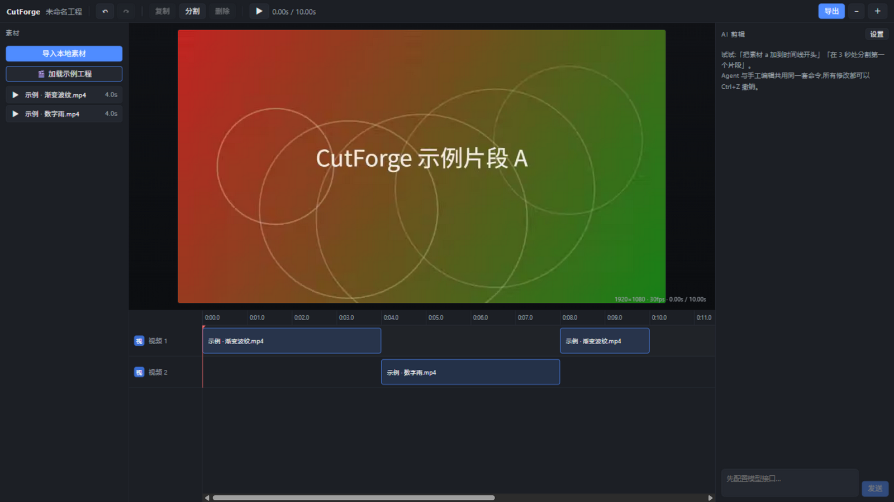

<div align="center">


# CutForge(工作代号)

**Agent 优先的开源 AI 视频编辑器 —— 社区版**

用对话驱动剪辑:你描述想法,AI 直接在真实的多轨时间线上完成添加、切割、
排列,每一步都可撤销、可继续手工调整。CutForge 不是"生成一段不可修改的
视频",而是维护一个真正可编辑的视频工程。

**[在线试用(GitHub Pages)](https://qwert702.github.io/cutforge/)** ·
[下载源码](https://github.com/qwert702/cutforge)



</div>

> 命名说明:"CutForge" 是开发代号,正式发布名待定。

## 快速开始

打开[在线版](https://qwert702.github.io/cutforge/),点击左侧
**「🎬 加载示例工程」**——应用会在浏览器里现场合成两段示例视频并铺上
时间线,你可以立即体验拖拽、分割、导出和 AI 对话剪辑,不需要导入任何文件。

本地开发:

```bash
npm install
npm run dev      # http://localhost:5300
npm test         # 核心逻辑单元测试
npm run lint
npm run build
```

要求 Node.js 20+(建议 24)。AI 功能在应用内"设置"里填入任一
OpenAI 兼容接口的 Base URL 与 API Key(存储在浏览器本地,不经过任何第三方)。

桌面版(Electron):

```bash
npm run build
npm run electron:dev        # 加载 dist
# 开发热重载:先 npm run dev,再 CF_DEV_URL=http://localhost:5300 npx electron .
npm run desktop:dist        # 打包 Windows NSIS 安装包(release/)
```

## 功能

- 🎞️ **多轨时间线**:视频/音频/图片/文字,拖拽、裁剪、分割、跨轨、多选
- ✍️ **文字标题与转场**:片段级淡入淡出(黑场/白场)、变速 0.25–4x、音量控制
- ↩️ **完整撤销栈**:不可变工程文档 + 命令层,手工与 AI 共用同一套命令
- 🤖 **AI 对话剪辑**:12 个时间线工具真实剪辑,操作被拒会阅读错误自动重试
- 📦 **浏览器内导出**:MP4(H.264)与 WebM(VP9)由 WebCodecs 客户端完成,素材不出本机
- 🖥️ **桌面应用**:Electron 壳,Windows 安装包一键打包
- 🔒 **隐私优先**:无遥测、无上报;素材与 API Key 全部留在本地

## 路线图

- [x] 时间线核心:不可变工程文档 + 命令层 + 撤销栈
- [x] 预览播放器与基础剪辑
- [x] Agent 对话剪辑(工具调用与手工编辑共用同一套命令层)
- [x] WebM 导出(WebCodecs,客户端完成)
- [x] 在线版与示例工程(无需安装即可体验)
- [x] MP4 导出(WebCodecs H.264,客户端完成)
- [x] 文字/标题、淡入淡出转场、变速与音量
- [x] Electron 桌面壳(Windows)
- [x] 关键帧动画(位置/缩放/不透明度/旋转,线性插值)
- [ ] 本地语音识别字幕
- [ ] Agent 提案/批准模式(改动先预览再应用)
- [ ] 云端增值服务(独立闭源服务,另行发布)

## 双版本模式

本仓库是**社区版**,以 AGPL-3.0-or-later 完全开源,本地剪辑能力永远免费完整可用。
规划中的 Pro 版(高级功能扩展与云服务)将作为独立产品提供,不影响本仓库。

向本仓库贡献代码前请阅读 [CLA.md](CLA.md)。

## 许可

Copyright (C) CutForge Contributors

本程序为自由软件:你可以依据自由软件基金会发布的 **GNU Affero 通用公共
许可证(AGPL-3.0-or-later)** 再分发与/或修改它;无论是第 3 版许可证还是
(按你的选择)任何更新的版本。

依据 AGPL-3.0 第 13 条,如果你将本程序修改后以网络服务形式向用户提供,
你也必须向这些用户提供修改后源代码的获取途径。

本程序不提供任何担保。详见 LICENSE 文件。
第三方组件遵循其各自的许可。
